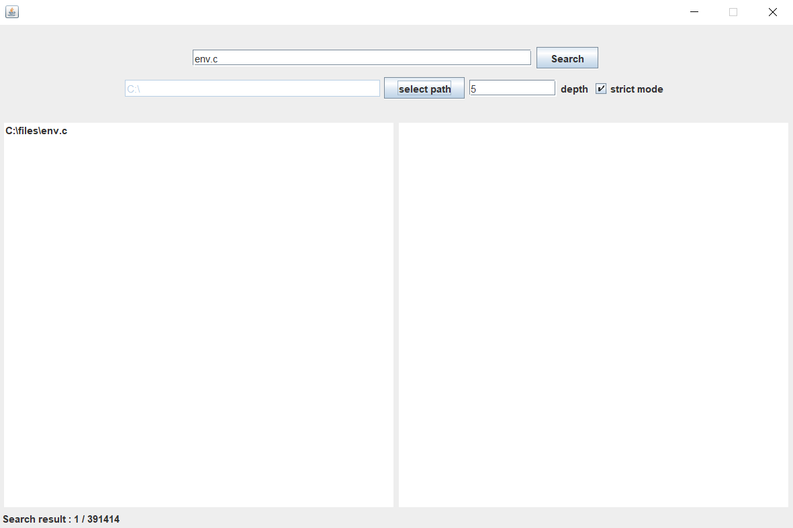

6/18

##기능
1. 검색 기능 만들었음, 엔터, 검색 버튼 event 추가
2. 검색 결과 result view 추가
	- 클릭 시 폴더, 파일 여는 기능 추가
	- preview 기능 추가 (현재 txt, c/cpp, java 지원)
	- 영어, 한국어, 일본어, 한자 확인 (테스트 pc - 기본 폰트 설치 되어 있음)
3. scan한 파일 개수, 검색 결과 파일 개수 label에 표시

##구현

##문제점
1. depth 값이 커지면 너무 느려진다.
	 - 400,000만개 검색 시간 - 평균 61274ms 정도 걸림
2. 프로그램 종료 시 백그라운드에서 계속 돌아가는 문제 있음.
